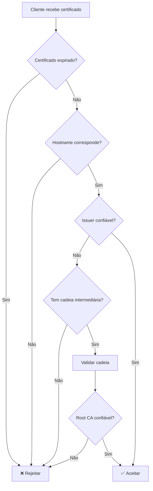

# Manual Completo: Certificados OpenSSL e TLS

## Índice
- [Conceitos Fundamentais](#conceitos-fundamentais)
- [Tipos de Certificados](#tipos-de-certificados)
- [Cadeia de Certificados](#cadeia-de-certificados)
- [Formatos de Certificados](#formatos-de-certificados)
- [Comandos OpenSSL Essenciais](#comandos-openssl-essenciais)
- [Validação de Certificados](#validação-de-certificados)
- [Certificados no Rancher](#certificados-no-rancher)
- [Troubleshooting](#troubleshooting)
- [Boas Práticas](#boas-práticas)

---

## Conceitos Fundamentais

### O que é um Certificado Digital?

Um certificado digital é um documento eletrônico que vincula uma chave pública a uma identidade (domínio, organização, pessoa). Ele é usado para:
- **Autenticação**: Provar a identidade de um servidor/cliente
- **Criptografia**: Estabelecer comunicação segura (HTTPS/TLS)
- **Integridade**: Garantir que os dados não foram alterados

### Componentes de um Certificado

```
┌─────────────────────────────────────────┐
│ Certificado Digital (X.509)             │
├─────────────────────────────────────────┤
│ • Subject (CN, O, OU, C, etc.)          │
│ • Issuer (quem emitiu)                  │
│ • Chave Pública                         │
│ • Validade (Not Before / Not After)     │
│ • Serial Number                         │
│ • Assinatura Digital (da CA)            │
│ • Extensões (SAN, Key Usage, etc.)      │
└─────────────────────────────────────────┘
```

### PKI (Public Key Infrastructure)

```
┌──────────────────────────────────────────────────────┐
│                    Root CA                           │
│              (Auto-assinado)                         │
│         Confiável por padrão no SO                   │
└────────────────┬─────────────────────────────────────┘
                 │
                 │ assina
                 ▼
┌──────────────────────────────────────────────────────┐
│            Intermediate CA                           │
│         (Assinado pela Root CA)                      │
│      Usado para assinar certificados                 │
└────────────────┬─────────────────────────────────────┘
                 │
                 │ assina
                 ▼
┌──────────────────────────────────────────────────────┐
│          End-Entity Certificate                      │
│         (Certificado do Servidor)                    │
│      Ex: rancher.arq.unb.br                          │
└──────────────────────────────────────────────────────┘
```

---

## Tipos de Certificados

### 1. Self-Signed Certificate (Auto-assinado)
```bash
# Gerar certificado auto-assinado
openssl req -x509 -newkey rsa:4096 -keyout key.pem -out cert.pem -days 365 -nodes
```

**Características:**
- ✅ Fácil de criar
- ✅ Sem custo
- ❌ Navegadores não confiam (warning)
- ❌ Não recomendado para produção
- ✅ Útil para desenvolvimento/testes

### 2. CA-Signed Certificate (Assinado por CA)

**CA Pública** (Let's Encrypt, DigiCert, GlobalSign):
- ✅ Confiável por padrão em navegadores/SOs
- ✅ Renovação automática (Let's Encrypt)
- ❌ Pode ter custo
- ✅ Recomendado para produção pública

**CA Privada/Corporativa** (CertiSign, CA interna):
- ✅ Controle total
- ✅ Sem custo recorrente
- ❌ Precisa distribuir CA root nos clientes
- ✅ Ideal para ambientes corporativos

---

## Cadeia de Certificados

### Estrutura da Cadeia

```
Arquivo                  Conteúdo
─────────────────────────────────────────────────────
tls.crt                  Certificado do servidor
                         (rancher.arq.unb.br)

intermediate.pem         Certificado Intermediário
                         (CertiSign Intermediate CA)

gs_root.pem             Certificado Root
                         (GlobalSign Root CA)

─────────────────────────────────────────────────────
Combinados:

tls-chain.crt           tls.crt + intermediate.pem + gs_root.pem
                        (Fullchain - usado para TLS)

ca-bundle.pem           intermediate.pem + gs_root.pem + R3
                        (CA Bundle - usado para validação)
```

### Por que preciso da cadeia completa?

Quando um cliente (navegador, kubectl, etc.) valida um certificado:

1. **Recebe**: Certificado do servidor (`tls.crt`)
2. **Verifica**: Quem assinou? → Intermediate CA
3. **Procura**: Intermediate CA está no trust store? → Não
4. **Precisa**: Certificado do Intermediate CA
5. **Verifica**: Quem assinou o Intermediate? → Root CA
6. **Procura**: Root CA está no trust store? → Sim! ✅
7. **Confia**: Cadeia validada com sucesso

**Sem a cadeia completa:**
```
❌ Erro: unable to get local issuer certificate
❌ Erro: certificate verify failed
```

---

## Formatos de Certificados

### PEM (Privacy Enhanced Mail)
```
-----BEGIN CERTIFICATE-----
MIIDXTCCAkWgAwIBAgIJAKJ...
(Base64 encoded)
...
-----END CERTIFICATE-----
```
- **Extensões**: `.pem`, `.crt`, `.cer`, `.key`
- **Encoding**: Base64
- **Uso**: Mais comum em Linux/Unix
- **Legível**: Pode abrir em editor de texto

### DER (Distinguished Encoding Rules)
```
(Binário - não legível)
```
- **Extensões**: `.der`, `.cer`
- **Encoding**: Binário
- **Uso**: Comum em Windows
- **Conversão**: `openssl x509 -inform DER -in cert.der -outform PEM -out cert.pem`

### PKCS#12 / PFX
```
(Binário - contém certificado + chave privada)
```
- **Extensões**: `.p12`, `.pfx`
- **Conteúdo**: Certificado + Chave Privada + Cadeia (tudo em um arquivo)
- **Protegido**: Geralmente com senha
- **Uso**: Exportar/importar em Windows, Java keystores
- **Conversão**: 
```bash
# Extrair certificado
openssl pkcs12 -in cert.p12 -clcerts -nokeys -out cert.pem

# Extrair chave privada
openssl pkcs12 -in cert.p12 -nocerts -nodes -out key.pem
```

---

## Comandos OpenSSL Essenciais

### Visualizar Certificado

```bash
# Ver detalhes do certificado
openssl x509 -in cert.pem -text -noout

# Ver apenas subject e issuer
openssl x509 -in cert.pem -noout -subject -issuer

# Ver datas de validade
openssl x509 -in cert.pem -noout -dates

# Ver Subject Alternative Names (SAN)
openssl x509 -in cert.pem -noout -ext subjectAltName

# Ver fingerprint (hash único)
openssl x509 -in cert.pem -noout -fingerprint -sha256
```

### Verificar Chave Privada

```bash
# Ver detalhes da chave privada
openssl rsa -in key.pem -text -noout

# Verificar se chave privada corresponde ao certificado
# (Os módulos devem ser idênticos)
openssl x509 -noout -modulus -in cert.pem | openssl md5
openssl rsa -noout -modulus -in key.pem | openssl md5
```

### Testar Conexão TLS

```bash
# Conectar e ver certificado do servidor
openssl s_client -connect rancher.arq.unb.br:443 -showcerts

# Verificar com SNI (Server Name Indication)
openssl s_client -connect rancher.arq.unb.br:443 -servername rancher.arq.unb.br

# Verificar com CA específica
openssl s_client -connect rancher.arq.unb.br:443 -CAfile ca-bundle.pem

# Testar protocolo TLS específico
openssl s_client -connect rancher.arq.unb.br:443 -tls1_2
openssl s_client -connect rancher.arq.unb.br:443 -tls1_3
```

### Criar Certificados

```bash
# Gerar chave privada RSA 4096 bits
openssl genrsa -out key.pem 4096

# Gerar CSR (Certificate Signing Request)
openssl req -new -key key.pem -out request.csr

# Gerar certificado auto-assinado
openssl req -x509 -newkey rsa:4096 -keyout key.pem -out cert.pem -days 365 -nodes

# Assinar CSR com CA privada
openssl x509 -req -in request.csr -CA ca.pem -CAkey ca-key.pem -CAcreateserial -out cert.pem -days 365
```

### Converter Formatos

```bash
# PEM para DER
openssl x509 -in cert.pem -outform DER -out cert.der

# DER para PEM
openssl x509 -in cert.der -inform DER -outform PEM -out cert.pem

# PEM para PKCS#12
openssl pkcs12 -export -out cert.p12 -inkey key.pem -in cert.pem -certfile ca-bundle.pem

# PKCS#12 para PEM
openssl pkcs12 -in cert.p12 -out cert.pem -nodes
```

### Combinar Certificados

```bash
# Criar fullchain (server + intermediate + root)
cat tls.crt intermediate.pem gs_root.pem > tls-chain.crt

# Criar CA bundle (intermediate + root)
cat intermediate.pem gs_root.pem > ca-bundle.pem

# Adicionar certificado adicional ao bundle
curl -sL https://secure.globalsign.com/cacert/root-r3.crt | \
  openssl x509 -inform DER -outform PEM >> ca-bundle.pem
```

---

## Validação de Certificados

### Como funciona a validação?



### Verificações realizadas:

1. **Validade temporal**: Certificado está dentro do período válido?
2. **Hostname**: CN ou SAN corresponde ao domínio acessado?
3. **Cadeia de confiança**: Consegue validar até uma Root CA confiável?
4. **Revogação**: Certificado não foi revogado? (CRL/OCSP)
5. **Assinatura**: Assinatura digital é válida?
6. **Key Usage**: Certificado tem permissão para o uso pretendido?

### Testar validação manualmente

```bash
# Verificar certificado contra CA bundle
openssl verify -CAfile ca-bundle.pem cert.pem

# Verificar com cadeia intermediária
openssl verify -CAfile root.pem -untrusted intermediate.pem cert.pem

# Verificar certificado de servidor remoto
echo | openssl s_client -connect rancher.arq.unb.br:443 -servername rancher.arq.unb.br 2>/dev/null | \
  openssl x509 -noout -text
```

---

## Certificados no Rancher

### Arquitetura de Certificados no Rancher

```
┌─────────────────────────────────────────────────────┐
│                 Rancher Server                      │
├─────────────────────────────────────────────────────┤
│                                                     │
│  Ingress TLS (rancher.arq.unb.br)                  │
│  ├─ Secret: rancher-tls                            │
│  │  ├─ tls.crt (server cert)                       │
│  │  └─ tls.key (private key)                       │
│  │                                                  │
│  privateCA: true                                    │
│  ├─ Secret: tls-ca                                 │
│  │  └─ cacerts.pem (fullchain)                     │
│  │                                                  │
│  additionalTrustedCAs: true                         │
│  └─ Secret: tls-ca-additional                      │
│     └─ ca-additional.pem (CA bundle)               │
│                                                     │
│  agentTLSMode: strict                              │
│  └─ Usa APENAS secrets, ignora system trust store  │
│                                                     │
└─────────────────────────────────────────────────────┘
```

### Secrets do Kubernetes

#### 1. `rancher-tls` (TLS Secret)
```bash
kubectl create secret tls rancher-tls \
  --cert=tls.crt \
  --key=tls.key \
  -n cattle-system
```
**Conteúdo:**
- `tls.crt`: Certificado do servidor (apenas o certificado, não a cadeia)
- `tls.key`: Chave privada

**Uso:** Ingress do Rancher para HTTPS

#### 2. `tls-ca` (Generic Secret)
```bash
kubectl create secret generic tls-ca \
  --from-file=cacerts.pem=tls-chain.crt \
  -n cattle-system
```
**Conteúdo:**
- `cacerts.pem`: Fullchain (server cert + intermediate + root)

**Uso:** Rancher valida a própria cadeia de certificados quando `privateCA: true`

#### 3. `tls-ca-additional` (Generic Secret)
```bash
kubectl create secret generic tls-ca-additional \
  --from-file=ca-additional.pem=ca-bundle.pem \
  -n cattle-system
```
**Conteúdo:**
- `ca-additional.pem`: CA bundle (intermediate + root + R3)

**Uso:** Rancher confia em CAs adicionais quando `additionalTrustedCAs: true`

### Parâmetros do Helm Chart

#### `privateCA`
```yaml
privateCA: true   # Usa secret tls-ca
privateCA: false  # Usa apenas system trust store
```

**Quando usar `true`:**
- ✅ Certificado assinado por CA privada/corporativa
- ✅ CA não está no trust store do sistema
- ✅ Quer controle total sobre a cadeia de confiança

**Quando usar `false`:**
- ✅ Certificado de CA pública (Let's Encrypt, DigiCert)
- ✅ CA já está no trust store do sistema

#### `additionalTrustedCAs`
```yaml
additionalTrustedCAs: true   # Usa secret tls-ca-additional
additionalTrustedCAs: false  # Não usa CAs adicionais
```

**Quando usar `true`:**
- ✅ Precisa confiar em CAs além da principal
- ✅ Integrações com sistemas que usam outras CAs
- ✅ Ambientes com múltiplas CAs corporativas

#### `agentTLSMode`
```yaml
agentTLSMode: strict        # Usa APENAS secrets
agentTLSMode: system-store  # Usa system trust store + secrets
```

**`strict`** (Recomendado):
- ✅ Mais seguro - controle total
- ✅ Previsível - não depende do sistema
- ✅ Consistente entre ambientes
- ❌ Precisa fornecer TODAS as CAs necessárias

**`system-store`**:
- ✅ Mais flexível - aceita CAs públicas automaticamente
- ❌ Menos previsível - depende do trust store do sistema
- ❌ Pode variar entre ambientes

---

## Troubleshooting

### Erro: "certificate verify failed"

**Causa:** Cliente não consegue validar a cadeia de certificados

**Diagnóstico:**
```bash
# Verificar cadeia
openssl s_client -connect rancher.arq.unb.br:443 -showcerts

# Verificar se tem intermediate
openssl s_client -connect rancher.arq.unb.br:443 2>&1 | grep -A 5 "Certificate chain"
```

**Solução:**
1. Verificar se fullchain está completo
2. Verificar se secret `tls-ca` está criado
3. Verificar se `privateCA: true` está configurado

### Erro: "unable to get local issuer certificate"

**Causa:** Falta certificado intermediário ou root

**Diagnóstico:**
```bash
# Verificar quantos certificados estão na cadeia
openssl s_client -connect rancher.arq.unb.br:443 -showcerts 2>&1 | grep -c "BEGIN CERTIFICATE"

# Deve retornar 3 (server + intermediate + root) ou pelo menos 2 (server + intermediate)
```

**Solução:**
```bash
# Criar fullchain correto
cat tls.crt intermediate.pem root.pem > tls-chain.crt

# Recriar secret
kubectl delete secret tls-ca -n cattle-system
kubectl create secret generic tls-ca \
  --from-file=cacerts.pem=tls-chain.crt \
  -n cattle-system
```

### Erro: "certificate has expired"

**Causa:** Certificado passou da data de validade

**Diagnóstico:**
```bash
# Ver datas de validade
openssl x509 -in cert.pem -noout -dates

# Ver quanto tempo falta
openssl x509 -in cert.pem -noout -checkend 86400  # Expira em 24h?
```

**Solução:**
1. Renovar certificado com a CA
2. Atualizar secrets no Kubernetes
3. Reiniciar pods do Rancher (se necessário)

### Erro: "Hostname mismatch"

**Causa:** CN ou SAN do certificado não corresponde ao hostname acessado

**Diagnóstico:**
```bash
# Ver CN e SAN
openssl x509 -in cert.pem -noout -subject -ext subjectAltName

# Exemplo de saída:
# subject=CN=rancher.arq.unb.br
# X509v3 Subject Alternative Name:
#     DNS:rancher.arq.unb.br, DNS:*.arq.unb.br
```

**Solução:**
1. Gerar novo certificado com CN/SAN corretos
2. Ou acessar usando o hostname que está no certificado

### Erro: "x509: certificate signed by unknown authority"

**Causa:** Root CA não está no trust store

**Diagnóstico:**
```bash
# Verificar se CA está no sistema
ls /etc/ssl/certs/ | grep -i globalsign

# Verificar secret
kubectl get secret tls-ca-additional -n cattle-system -o yaml
```

**Solução:**
```bash
# Adicionar CA ao bundle
cat intermediate.pem root.pem > ca-bundle.pem

# Atualizar secret
kubectl delete secret tls-ca-additional -n cattle-system
kubectl create secret generic tls-ca-additional \
  --from-file=ca-additional.pem=ca-bundle.pem \
  -n cattle-system
```

### Debug de Secrets no Kubernetes

```bash
# Listar secrets
kubectl get secrets -n cattle-system | grep tls

# Ver conteúdo do secret (base64 encoded)
kubectl get secret rancher-tls -n cattle-system -o yaml

# Decodificar e ver certificado
kubectl get secret rancher-tls -n cattle-system -o jsonpath='{.data.tls\.crt}' | \
  base64 -d | openssl x509 -text -noout

# Verificar se chave privada corresponde ao certificado
kubectl get secret rancher-tls -n cattle-system -o jsonpath='{.data.tls\.crt}' | \
  base64 -d | openssl x509 -noout -modulus | openssl md5

kubectl get secret rancher-tls -n cattle-system -o jsonpath='{.data.tls\.key}' | \
  base64 -d | openssl rsa -noout -modulus | openssl md5
```

---

## Boas Práticas

### 1. Organização de Arquivos

```
certificados/
├── rancher.arq.unb.br/
│   ├── tls.crt              # Certificado do servidor
│   ├── tls.key              # Chave privada (PROTEGER!)
│   ├── intermediate.pem     # Certificado intermediário
│   ├── root.pem             # Certificado root
│   ├── tls-chain.crt        # Fullchain (gerado)
│   └── ca-bundle.pem        # CA bundle (gerado)
└── README.md                # Documentação
```

### 2. Segurança da Chave Privada

```bash
# Permissões corretas
chmod 600 tls.key
chown root:root tls.key

# Nunca commitar no Git
echo "*.key" >> .gitignore
echo "*.pem" >> .gitignore

# Backup criptografado
tar czf certs-backup.tar.gz certificados/
gpg -c certs-backup.tar.gz
rm certs-backup.tar.gz
```

### 3. Renovação de Certificados

```bash
# Verificar validade regularmente
openssl x509 -in tls.crt -noout -checkend $((30*86400))  # Expira em 30 dias?

# Criar alerta
if ! openssl x509 -in tls.crt -noout -checkend $((30*86400)); then
  echo "ALERTA: Certificado expira em menos de 30 dias!"
fi
```

### 4. Validação Antes de Deploy

```bash
# Checklist antes de atualizar certificados:

# 1. Verificar validade
openssl x509 -in tls.crt -noout -dates

# 2. Verificar hostname
openssl x509 -in tls.crt -noout -subject -ext subjectAltName

# 3. Verificar chave privada corresponde
openssl x509 -noout -modulus -in tls.crt | openssl md5
openssl rsa -noout -modulus -in tls.key | openssl md5

# 4. Verificar cadeia completa
openssl verify -CAfile root.pem -untrusted intermediate.pem tls.crt

# 5. Testar localmente
openssl s_server -cert tls.crt -key tls.key -CAfile ca-bundle.pem -accept 8443 &
curl -v --cacert ca-bundle.pem https://localhost:8443
```

### 5. Documentação

Sempre documentar:
- **Origem**: De onde veio o certificado? (CA, auto-assinado, etc.)
- **Validade**: Quando expira?
- **Contatos**: Quem pode renovar?
- **Processo**: Como renovar?
- **Dependências**: Quais sistemas usam este certificado?

### 6. Monitoramento

```bash
# Script de monitoramento
#!/bin/bash
CERT_FILE="/path/to/tls.crt"
DAYS_WARNING=30

EXPIRY_DATE=$(openssl x509 -in "$CERT_FILE" -noout -enddate | cut -d= -f2)
EXPIRY_EPOCH=$(date -d "$EXPIRY_DATE" +%s)
NOW_EPOCH=$(date +%s)
DAYS_LEFT=$(( ($EXPIRY_EPOCH - $NOW_EPOCH) / 86400 ))

if [ $DAYS_LEFT -lt $DAYS_WARNING ]; then
  echo "ALERTA: Certificado expira em $DAYS_LEFT dias!"
  # Enviar email, Slack, etc.
fi
```

---

## Referências

### Documentação Oficial
- [OpenSSL Documentation](https://www.openssl.org/docs/)
- [RFC 5280 - X.509 Certificate](https://tools.ietf.org/html/rfc5280)
- [Rancher TLS Configuration](https://ranchermanager.docs.rancher.com/getting-started/installation-and-upgrade/resources/custom-ca-root-certificate)

### Ferramentas Úteis
- [SSL Labs Server Test](https://www.ssllabs.com/ssltest/) - Testar configuração TLS de servidores
- [Certificate Decoder](https://www.sslshopper.com/certificate-decoder.html) - Decodificar certificados online
- [SSL Checker](https://www.sslchecker.com/) - Verificar instalação de certificados

### Comandos Rápidos

```bash
# Ver certificado
openssl x509 -in cert.pem -text -noout

# Testar servidor
openssl s_client -connect host:443 -servername host

# Verificar cadeia
openssl verify -CAfile ca.pem cert.pem

# Ver datas
openssl x509 -in cert.pem -noout -dates

# Converter DER para PEM
openssl x509 -inform DER -in cert.der -outform PEM -out cert.pem
```

---

## Conclusão

Certificados TLS/SSL são fundamentais para segurança, mas podem ser complexos. Este manual cobre:

✅ Conceitos fundamentais de PKI e certificados  
✅ Tipos e formatos de certificados  
✅ Comandos OpenSSL essenciais  
✅ Configuração específica para Rancher  
✅ Troubleshooting de problemas comuns  
✅ Boas práticas de segurança e manutenção  

**Dica final:** Sempre teste certificados em ambiente de desenvolvimento antes de aplicar em produção!
